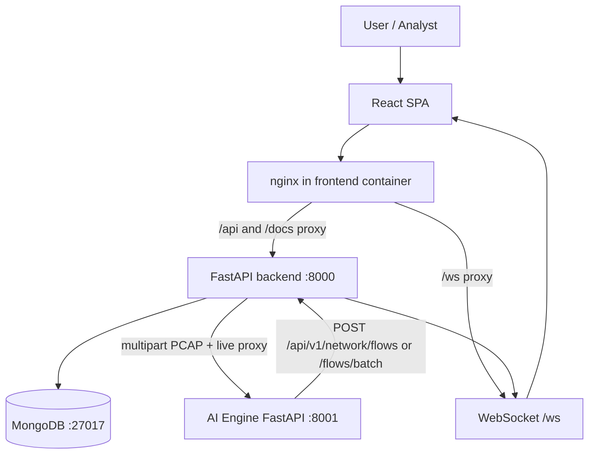
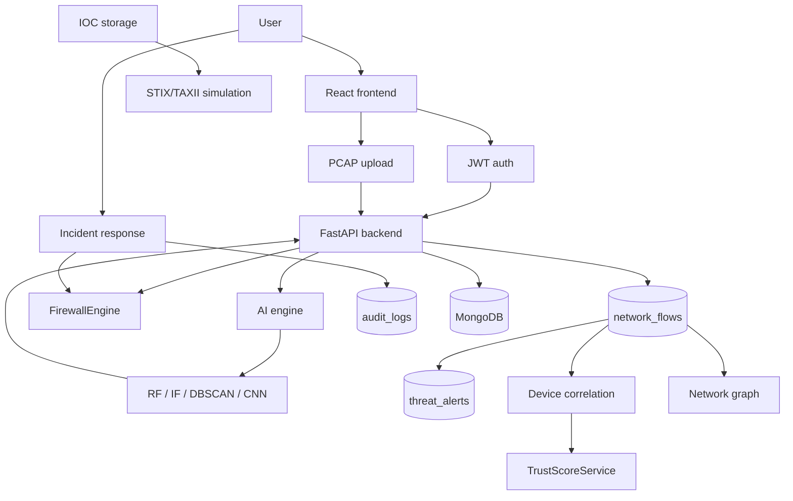

# AI-Powered Next Generation Firewall (AI-NGFW) with Zero Trust Architecture

**Subtitle:** Comprehensive Project Documentation, Architecture, Machine Learning, Security, Implementation and Testing Guide

**Project type:** Academic / prototype AI-powered security platform (not a production enterprise firewall, not a certified TAXII server, not a full ZTNA product, not an inline kernel-level packet filter).

**Source of truth:** The repository at `F:\Main_Project`. Claims below are tagged:

| Status | Meaning |
|--------|---------|
| **Implemented** | Code exists in the repository |
| **Implemented and verified** | Code exists and automated tests (or saved model/dataset metadata) confirm it |
| **Simulation** | Behaviour is intentionally simulated (STIX/TAXII feed, country-from-IP) |
| **Storage/search only** | Feature stores and looks up data but is not wired into traffic detection |
| **Application-layer** | Decisioning in the application/API, not on a network datapath |
| **Environment-dependent** | Result depends on Docker/Windows/host networking or live MongoDB contents |
| **Scaffolded** | Collection/indexes/permissions exist with little or no product usage |
| **Not implemented** | Missing as a working product capability |

Secrets, passwords, JWT values, MongoDB credentials, `SECRET_KEY`, and API keys are **not** included. If a config file contains a default, this document uses `[REDACTED]`.

---

## Table of contents

1. [Part 1 — Project in one minute](#part-1--project-in-one-minute)
2. [Part 2 — What problem does this project solve?](#part-2--what-problem-does-this-project-solve)
3. [Part 3 — Project objectives](#part-3--project-objectives)
4. [Part 4 — Complete system architecture](#part-4--complete-system-architecture)
5. [Part 5 — Complete frontend](#part-5--complete-frontend)
6. [Part 6 — Backend](#part-6--backend)
7. [Part 7 — Frontend ↔ backend connection](#part-7--frontend--backend-connection)
8. [Part 8 — Backend ↔ MongoDB](#part-8--backend--mongodb)
9. [Part 9 — AI engine](#part-9--ai-engine)
10. [Part 10 — Dataset](#part-10--dataset)
11. [Part 11 — Data preprocessing](#part-11--data-preprocessing)
12. [Part 12 — What data was used to train the models?](#part-12--what-data-was-used-to-train-the-models)
13. [Part 13 — Random Forest](#part-13--random-forest)
14. [Part 14 — Isolation Forest](#part-14--isolation-forest)
15. [Part 15 — DBSCAN](#part-15--dbscan)
16. [Part 16 — CNN](#part-16--cnn)
17. [Part 17 — Model artifacts](#part-17--model-artifacts)
18. [Part 18 — Model inference pipeline](#part-18--model-inference-pipeline)
19. [Part 19 — PCAP upload pipeline](#part-19--pcap-upload-pipeline)
20. [Part 20 — Firewall](#part-20--firewall)
21. [Part 21 — Zero Trust](#part-21--zero-trust)
22. [Part 22 — Device inventory](#part-22--device-inventory)
23. [Part 23 — Zero Trust + network flow integration](#part-23--zero-trust--network-flow-integration)
24. [Part 24 — Incident response](#part-24--incident-response)
25. [Part 25 — Audit logging](#part-25--audit-logging)
26. [Part 26 — IOC database](#part-26--ioc-database)
27. [Part 27 — STIX/TAXII](#part-27--stixtaxii)
28. [Part 28 — Network graph](#part-28--network-graph)
29. [Part 29 — Threat analytics](#part-29--threat-analytics)
30. [Part 30 — Authentication](#part-30--authentication)
31. [Part 31 — RBAC](#part-31--rbac)
32. [Part 32 — Security](#part-32--security)
33. [Part 33 — Docker](#part-33--docker)
34. [Part 34 — Live capture](#part-34--live-capture)
35. [Part 35 — Complete data flow](#part-35--complete-data-flow)
36. [Part 36 — Complete API map](#part-36--complete-api-map)
37. [Part 37 — Complete file structure](#part-37--complete-file-structure)
38. [Part 38 — Testing](#part-38--testing)
39. [Part 39 — Verified end-to-end scenario](#part-39--verified-end-to-end-scenario)
40. [Part 40 — What is not implemented](#part-40--what-is-not-implemented)
41. [Part 41 — Why certain things were not implemented](#part-41--why-certain-things-were-not-implemented)
42. [Part 42 — Strengths](#part-42--strengths)
43. [Part 43 — Limitations](#part-43--limitations)
44. [Part 44 — Future enhancements](#part-44--future-enhancements)
45. [Part 45 — Installation / running the project](#part-45--installation--running-the-project)
46. [Part 46 — How to demonstrate the project](#part-46--how-to-demonstrate-the-project)
47. [Part 47 — Viva explanation](#part-47--viva-explanation)
48. [Part 48 — Explain the code like a kid](#part-48--explain-the-code-like-a-kid)
49. [Part 49 — Important code file explanations](#part-49--important-code-file-explanations)
50. [Part 50 — Final project summary](#part-50--final-project-summary)

---

# Part 1 — Project in one minute

## Simple explanation

Imagine a **security guard** at the door of a building.

The guard:

- watches who comes in and out (**network traffic**)
- notices odd behaviour (**suspicious patterns**)
- has been trained with many past examples of attacks (**machine learning**)
- checks a list of house rules (**firewall rules**)
- does not automatically trust someone just because they are already inside (**Zero Trust**)
- writes everything in a diary (**audit logs**)
- can stop a visitor and call investigators (**incident response**)

**AI-NGFW** is that guard for **computer networks**.

A **computer network** is how devices talk: phones, laptops, servers, and the internet. Each conversation is made of tiny messages called **packets**. Many packets that belong together are grouped into a **flow** (like one phone call made of many sound snippets).

## Conceptual pipeline

```text
Internet / lab traffic
        ↓
Packet or flow information (IP addresses, ports, sizes, flags)
        ↓
AI threat detection (trained models look for attack-like patterns)
        ↓
Firewall decision (allow / block / temporary block / blacklist / whitelist)
        ↓
Zero Trust evaluation (device + user + behaviour scores)
        ↓
Threat alert (if the AI says it looks like an attack)
        ↓
Incident response (a human analyst investigates and can contain)
        ↓
Containment (block IP, kill session, write a report)
        ↓
Audit logs (who did what, when)
```

## Where MongoDB fits

**MongoDB** is the project’s **filing cabinet**.

It stores users, devices, firewall rules, uploaded PCAP records, network flows, threat alerts, trust scores, incidents, IOC indicators, STIX objects, sessions, and audit logs. The React dashboard **does not talk to MongoDB directly**. The FastAPI backend reads and writes MongoDB, then sends JSON to the frontend.

## Technical explanation

The platform is four Docker services: **frontend** (React SPA + nginx), **backend** (FastAPI), **AI engine** (FastAPI + scikit-learn + TensorFlow + Scapy), and **MongoDB 7**. The backend prefix is `/api/v1`. The AI engine exposes `/health`, `POST /api/v1/analyze/pcap`, `POST /api/v1/analyze/live`, and `GET /api/v1/analyze/live/capabilities`. There is **no** standalone `/predict` HTTP route on the AI engine; prediction happens inside PCAP/live analysis via `AttackPredictor`.

---

# Part 2 — What problem does this project solve?

## Simple explanation

A **traditional firewall** is like a bouncer with a printed guest list: “this IP is allowed, that port is blocked.” That works for simple cases. Modern attacks often look like normal traffic, use many small steps, or hide inside allowed protocols. A list of rules cannot remember every new trick.

**Machine learning** helps because it can learn patterns from millions of labelled examples (this project uses **CICIDS2017**). **Zero Trust** helps because being “inside the network” is not enough: the system still scores users and devices. A **dashboard** helps people see alerts, graphs, and logs in one place. **Incident response** matters because detecting a problem is useless if nobody contains it.

## Technical explanation

Limitations of simple rule-based firewalls:

- Static IP/port/protocol matching cannot classify most CICIDS2017 attack types from raw payload inspection in this prototype (payloads are not decrypted; the CNN uses **reshaped flow statistics**, not real encrypted payloads).
- Attackers rotate IPs; IOC lists go stale.
- Class imbalance: most CICIDS2017 rows are `BENIGN`, so “always guess BENIGN” would look accurate but fail operationally.

This project combines:

1. Supervised classification (Random Forest, CNN)
2. Unsupervised anomaly detection (Isolation Forest)
3. Density clustering with nearest-neighbour inference (DBSCAN)
4. Application-layer firewall evaluation on **ingested flows** (not kernel netfilter)
5. Application-layer trust scoring
6. Operator workflows (incidents, audit, IOC storage, STIX/TAXII **simulation**)

---

# Part 3 — Project objectives

Objectives **supported by the repository**:

| Objective | Status |
|-----------|--------|
| Intelligent network threat detection via ML on flows | Implemented (metadata + inference code verified) |
| Firewall rule enforcement on flow ingest | Implemented and verified (unit tests) |
| ML-based detection (RF, IF, DBSCAN, CNN) | Implemented (trained artifacts present locally) |
| Zero Trust composite trust scoring | Implemented and verified (unit tests for ingest correlation) |
| Device inventory | Implemented and verified (service tests) |
| Incident response (create, update, block IP, kill session, report) | Implemented |
| IOC management (CRUD, search, stats, reputation check) | Implemented — **storage/search only** for traffic |
| STIX/TAXII threat intelligence **simulation** | Simulation |
| Network graph visualization (NetworkX) | Implemented (data-driven from `network_flows`) |
| Threat analytics / dashboard scoring | Implemented |
| Audit logging | Implemented |
| Authentication (JWT, register, login, refresh, logout) | Implemented and verified (RBAC register tests) |
| Role-based access control (admin / analyst / viewer) | Implemented and verified |
| Docker Compose deployment | Implemented |
| PCAP analysis | Implemented |
| Live capture capability | Implemented; **environment-dependent** under Docker Desktop on Windows |

---

# Part 4 — Complete system architecture

## Simple explanation

Four rooms:

1. **Frontend** — the screens you click
2. **Backend** — the receptionist and office workers
3. **AI engine** — the brain that looks at packet files
4. **MongoDB** — the filing cabinet

## Technical architecture



**Side connections (actual):**

- **Internal ingest auth:** `X-Internal-Api-Key`, JWT with `network:write`, or in **development** a User-Agent starting with `AI-NGFW-FeatureSender` (`require_network_ingest` in `backend/core/auth_utils.py`).
- **Country matching** uses `services/country_simulation.py` (**Simulation**: IP→country is not a production GeoIP product).
- **Policies collection** is indexed but has **no policy engine routes** (**Scaffolded**).
- **Rate limit settings** exist in `backend/config.py` but are **not implemented** as middleware.

Default Compose ports:

| Service | Host port |
|---------|-----------|
| Frontend | 80 |
| Backend | 8000 |
| AI engine | 8001 |
| MongoDB | `127.0.0.1:27017` |

---

# Part 5 — Complete frontend

## Simple explanation

The frontend is a **website dashboard**. **React** builds screens from reusable pieces (components). **Vite** is the development/build tool. **Tailwind CSS** styles the dark UI. **React Router** chooses which page to show. **Axios** talks to the backend.

## Stack (from `frontend/package.json`)

- React 18.3, TypeScript, Vite 6, Tailwind 3.4, Axios, Recharts, React Router 6
- Tests: Vitest

## Routing and protection

File: `frontend/src/routes/AppRoutes.tsx`

- `/login` — public; redirects away if already authenticated
- All dashboard routes sit under `ProtectedRoute` (JWT required)
- `/admin` additionally requires `user.role === "admin"` (`AdminRoute`)

Navigation: `frontend/src/config/navigation.ts`. **Admin Panel appears in the sidebar for all logged-in users**, but non-admins who open `/admin` are redirected to `/`.

## Environment / API client

| Item | Value |
|------|--------|
| Default API base | `VITE_API_BASE_URL` or `http://localhost:8000/api/v1` (`frontend/src/config/env.ts`) |
| Docker build arg | `VITE_API_BASE_URL=/api/v1` (same-origin via nginx) |
| Default timeout | 30_000 ms |
| PCAP upload timeout | 120_000 ms (`packetService.ts`) |
| WebSocket | `VITE_WS_BASE_URL` or `/ws?token=` |

JWT: request interceptor attaches `Authorization: Bearer <access_token>`. On HTTP 401, response interceptor refreshes via queue (`frontend/src/services/api/interceptors.ts`, `auth.ts`).

## Pages

| URL | Page file | Purpose | Typical APIs | Roles |
|-----|-----------|---------|--------------|-------|
| `/login` | `LoginPage.tsx` | Sign in / register | `POST /auth/login`, `POST /auth/register` | Public |
| `/` | `DashboardHomePage.tsx` | KPIs, traffic, alerts, live capture button | `/dashboard/*`, `/capture/live` | Any authenticated with `dashboard:read` / capture perms |
| `/zero-trust` | `ZeroTrustDashboardPage.tsx` | Trust gauges and tables | `/trust-scores/*` | `trust:read` |
| `/devices` | `DeviceInventoryPage.tsx` | Register/list devices | `/devices` | `devices:read`; writes need `devices:write` (**admin only** in RBAC) |
| `/network` | `NetworkGraphPage.tsx` | Topology graph | `GET /network-graph` | `network:read` |
| `/threats` | `ThreatAnalyticsPage.tsx` | Attack charts | dashboard + threat hooks | `dashboard:read` |
| `/analytics` | `AnalyticsDashboardPage.tsx` | Daily/monthly/protocol/country | `/analytics/*` | `dashboard:read` |
| `/ioc-database` | `IOCDatabasePage.tsx` | IOC CRUD UI | `/ioc-database/*` | `threats:read` / `threats:write` |
| `/stix-taxii` | `StixTaxiiPage.tsx` | Sync/stats/objects | `/stix-taxii/*` | `threats:read` / `threats:write` |
| `/incidents` | `IncidentDashboardPage.tsx` | IR workflow | `/incident-response/*` | incidents permissions |
| `/admin` | `AdminPanelPage.tsx` | Users, rules, logs, intel | `/users`, firewall, logs, TI | **UI: admin only** |
| `/firewall` | `FirewallPage.tsx` | Rule CRUD | `/firewall-rules/*` | `firewall:read` / write / delete |
| `/logs` | `LogsPage.tsx` | Audit search | `/logs` | `audit:read` |
| `/packets` | `PacketUploadPage.tsx` | PCAP upload | `/packet-upload` | `capture:write` to upload |
| `/settings` | `SettingsPage.tsx` | App version + live capture capabilities | `GET /capture/live/capabilities` | `capture:read` |

Charts: Recharts in `components/dashboard`, `components/analytics`, `components/threats`, `components/zeroTrust`, `components/stixTaxii`. Network graph: `components/network/NetworkGraphViewer.tsx`. Forms/modals: firewall, devices, IOC, incidents, packet analysis.

## Important frontend files

| File | Purpose | Important symbols |
|------|---------|-------------------|
| `src/main.tsx` | Entry | React root |
| `src/App.tsx` | App shell | Routes |
| `src/routes/AppRoutes.tsx` | Routing | `ProtectedRoute`, `AdminRoute` |
| `src/config/navigation.ts` | Sidebar items | `navigationItems` |
| `src/config/env.ts` | Env accessors | `API_BASE_URL`, `buildWebSocketUrl` |
| `src/services/api/apiClient.ts` | Axios instance | `apiClient` |
| `src/services/api/apiService.ts` | GET/POST/PUT/PATCH/DELETE | `apiService` |
| `src/services/api/interceptors.ts` | JWT + refresh | `setupRequestInterceptor` |
| `src/services/api/auth.ts` | Token attach/refresh | `attachAuthHeader`, `queueTokenRefresh` |
| `src/services/authService.ts` | Login/register/me | Auth API wrappers |
| `src/services/packetService.ts` | PCAP | `uploadPcapFile` (120s timeout) |
| `src/services/deviceService.ts` | Devices | CRUD |
| `src/services/firewallService.ts` | Firewall rules | CRUD |
| `src/services/trustScoreService.ts` | Zero Trust | list/calculate |
| `src/services/incidentService.ts` | Incidents | create/block/kill/report |
| `src/services/iocService.ts` | IOC | CRUD/search |
| `src/services/stixTaxiiService.ts` | STIX UI | stats/sync |
| `src/services/dashboardService.ts` | Dashboard | statistics/alerts |
| `src/services/analyticsService.ts` | Analytics | overview |
| `src/services/networkGraphService.ts` | Graph | fetch graph |
| `src/services/liveCaptureService.ts` | Live capture | capabilities + run |
| `src/services/adminService.ts` | Admin panels | users/logs/intel |
| `src/hooks/useAuth.ts` | Auth state | `isAuthenticated`, `user` |
| `src/hooks/useLiveTraffic.ts` | Dashboard traffic | polling/fetch |
| `src/hooks/useThreatAnalytics.ts` | Threat page | charts data |
| `src/hooks/useZeroTrustDashboard.ts` | ZT page | stats |
| `src/hooks/useNetworkGraph.ts` | Graph page | graph fetch |
| `src/providers/AppProviders.tsx` | Context | app providers |
| `src/providers/ThreatAlertSocketProvider.tsx` | WS alerts | live toasts |
| `src/layouts/DashboardLayout.tsx` | Shell | Navbar + Sidebar |
| `src/utils/ipAddress.ts` | IP validation | `isValidOptionalIpAddress` |
| `src/types/*.ts` | TypeScript models | dashboard, device, firewall, etc. |

Generated junk (`node_modules`, `dist`) is omitted.

---

# Part 6 — Backend

## Simple explanation

**FastAPI** is a Python web framework. Each URL is a **route**. A **schema** checks the incoming form. A **service** does the work. A **model** describes documents stored in MongoDB.

## Request flow

```text
Frontend
  → HTTP request
  → FastAPI router (`backend/api/routes/*.py`)
  → Pydantic schema validation
  → Authentication (`get_current_user` / OAuth2 bearer)
  → Permission check (`require_permission` / `require_roles` / `require_network_ingest`)
  → Service (`backend/services/*.py`)
  → MongoDB (Motor async client)
  → JSON response
  → Frontend
```

## Application entry

`backend/main.py`:

- Lifespan connects MongoDB (`connect_to_mongodb` also **ensures indexes**)
- CORS from settings
- `api_router` mounted at `settings.api_v1_prefix` (default `/api/v1`)
- WebSocket router at `/ws`
- Health: `GET /`, `/health`, `/health/ready`, `/health/live`

## Backend file / function table (major)

| File | Purpose | Important pieces |
|------|---------|------------------|
| `main.py` | App factory | `app`, health handlers, CORS |
| `config.py` | Settings | JWT, Mongo, AI URL, PCAP 100 MB, min trust 60 |
| `database.py` | Motor + collections | `CollectionNames`, `ensure_indexes` |
| `api/router.py` | Include all REST routers | `api_router` |
| `core/auth_utils.py` | AuthZ | `ROLE_PERMISSIONS`, `require_permission` |
| `core/jwt_handler.py` | JWT | create/verify access & refresh |
| `core/password.py` | bcrypt | `hash_password`, `verify_password` |
| `core/firewall_wildcards.py` | `any`/`*` matching | `is_unrestricted_value` |
| `core/websocket_manager.py` | Alert broadcast | `broadcast_threat_alert` |
| `services/network_flow_service.py` | Ingest | firewall + ZT + alerts |
| `services/firewall_engine.py` | Evaluate rules | `evaluate_flow` |
| `services/trust_score_service.py` | Composite score | weights 0.35/0.35/0.30 |
| `services/packet_upload_service.py` | PCAP | validate, store, call AI |
| `services/ai_engine_client.py` | HTTP to AI | `submit_pcap_for_analysis` |
| `services/dashboard_service.py` | KPIs | `_calculate_threat_score` |
| `services/incident_response_service.py` | IR | block IP, kill session |
| `services/stix_taxii_service.py` | TAXII sim | `sync_simulation` |
| `services/device_service.py` | Inventory | CRUD |
| `scripts/seed_ioc_database.py` | Sample IOCs | optional seed |

Tests live in `backend/tests/` (see Part 38).

---

# Part 7 — Frontend ↔ backend connection

## Simple explanation

The website asks the backend questions using **HTTP** (the same kind of request a browser uses). The backend answers with **JSON** (structured text). A **JWT** is a signed ticket proving you logged in.

## Technical details

1. Docker production: browser calls `http://localhost/api/v1/...`; nginx proxies `/api/` to `http://backend:8000`.
2. Local Vite: `npm run dev` on port **5173**; `vite.config.ts` proxies `/api` to `http://localhost:8000`.
3. Axios `baseURL` is `API_BASE_URL`.
4. Login stores access + refresh tokens (client util in `frontend/src/utils` via `auth.ts`).
5. Multipart PCAP: `FormData` with field `file`; Content-Type set to `multipart/form-data`.
6. Errors: `normalizeApiError` in `frontend/src/services/api/errors.ts`.
7. CORS: backend `CORSMiddleware` with `CORS_ORIGINS` (Compose includes localhost and `http://frontend`).
8. Polling: dashboard/live traffic hooks fetch periodically (implementation in `useLiveTraffic.ts`); WebSocket pushes new threat alerts.

### Example chain: PCAP upload

```text
PacketUploadPanel
  → uploadPcapFile()
  → POST /packet-upload (multipart, 120s timeout)
  → packet_upload.py
  → PacketUploadService.upload_pcap
  → PacketValidator + MongoDB packet_uploads
  → AIEngineClient POST {AI_ENGINE_URL}/api/v1/analyze/pcap
  → AI engine Scapy + AttackPredictor
  → FeatureSender POST /api/v1/network/flows/batch
  → NetworkFlowService
  → MongoDB network_flows + threat_alerts
  → JSON back to React → status UI
```

Do not paste real JWTs into reports.

---

# Part 8 — Backend ↔ MongoDB

## Simple explanation

MongoDB is a cabinet of **folders** (databases) containing **drawers** (collections) of **files** (documents). Unlike a spreadsheet, each document is a JSON-like record.

## Configuration

- Driver: **Motor** (`AsyncIOMotorClient`) in `database.py`. PyMongo is used for index models.
- Default database name: `ai_ngfw` (`MONGODB_DATABASE`).
- Compose service: `mongodb` image `mongo:7`, volume `mongodb_data`.
- Credentials: environment-dependent; **do not publish** (`[REDACTED]`).

## Collections

| Collection | Purpose | Important fields | Created by | Read by | Usage |
|------------|---------|------------------|------------|---------|--------|
| `users` | Accounts | email, username, hashed_password, role, is_active | register | auth, users list, ZT | Active |
| `devices` | Inventory | device_id, ip_address, user_id, is_trusted, is_compliant, last_seen_at | device APIs | ZT, flow correlation | Active |
| `policies` | Indexes only | name, is_active, priority | **almost unused** | helper `get_policies_collection` | **Scaffolded** |
| `firewall_rules` | Rules | source/dest IP/port, protocol, action, priority, is_enabled, expires_at | firewall + auto rules | FirewallEngine | Active |
| `network_flows` | Ingested flows | IPs, ports, is_threat, prediction, device_id, user_id | AI sender / ingest API | dashboard, graph, analytics | Active |
| `threat_alerts` | Alerts | severity, status, source_ip, flow_id | ingest on threat | dashboard, ZT device penalty | Active |
| `ioc_indicators` | IOC store | ioc_type, value, reputation_score, is_malicious | IOC/TI APIs | search, STIX sync, IR reports | Active storage |
| `packet_uploads` | PCAP jobs | upload_id, file_hash, status, ai_engine_status | upload API | status UI | Active |
| `audit_logs` | Security diary | event_type, severity, message, user, ip | IR and log APIs | logs UI, ZT failed-auth | Active |
| `sessions` | Login sessions | jti, user_id, is_active | login/register | logout, kill session | Active |
| `behaviour_events` | ZT behaviour | event_type, risk_level | trust APIs | behaviour score | Active |
| `trust_scores` | Scores | composite_score, trust_level, is_access_allowed | calculate/store | ZT dashboard | Active |
| `taxii_collections` | Simulated TAXII | collection_id, title | STIX service | TAXII + UI | Simulation |
| `stix_objects` | STIX docs | stix_id, object_type, stix_payload | sync | TAXII + UI | Simulation |
| `incidents` | IR cases | status, severity, source_ip | IR APIs | IR UI | Active |
| `incident_reports` | JSON reports | report_id, incident_id | generate report | IR | Active |
| `revoked_tokens` | JWT denylist | jti, TTL index | logout/kill session | `get_current_user` | Active |

---

# Part 9 — AI engine

## Simple explanation

The **AI engine** is a separate program so heavy ML libraries (TensorFlow) do not have to live inside the main API. The backend sends a PCAP file; the engine reads packets, builds flows, asks the models, and sends results back.

## Why it exists

Isolation of inference, Scapy capture, and model files (`ai_engine/ml/models`, `ai_engine/data/processed` mounted read-only in Compose).

## FastAPI (`ai_engine/main.py`) — **actual routes only**

| Method | Endpoint | Purpose |
|--------|----------|---------|
| GET | `/health` | Models loaded, live capture flag |
| GET | `/api/v1/analyze/live/capabilities` | Interface/BPF/config |
| POST | `/api/v1/analyze/live` | Bounded live capture + ML |
| POST | `/api/v1/analyze/pcap` | Multipart PCAP analysis |

**Not implemented:** a public `/predict` REST endpoint.

On startup: `load_predictor()` → `PcapAnalyzer` + `LiveCaptureService`.

Pipeline:

```text
Backend
  → AI Engine HTTP
  → Scapy parse PCAP / live sniffer
  → flow_generator
  → feature extraction aligned to CICIDS columns
  → AttackPredictor (RF, IF, DBSCAN NN, CNN)
  → weighted ensemble
  → FeatureSender → backend ingest
  → MongoDB via backend
```

**Scapy:** packet capture and PCAP readers (`network/packet_capture.py`, validator packet counting).

---

# Part 10 — Dataset

## Simple explanation

To teach a computer “this looks like an attack,” you need **examples**. **CICIDS2017** is a public research dataset of office-like network traffic plus labelled attacks (DoS, port scan, brute force, and others). **Benign** means ordinary, non-attack traffic. A **feature** is a measured number (duration, packet counts, flag counts). A **label** is the answer the teacher wrote on the example.

## Why CICIDS2017

It is a standard IDS benchmark with flow-level CSV features matching this project’s 78 numeric columns after header normalization.

## Actual files on disk

Eight raw CSVs under `ai_engine/data/raw/cicids2017/`:

- `Friday-WorkingHours-Afternoon-DDos.pcap_ISCX.csv`
- `Friday-WorkingHours-Afternoon-PortScan.pcap_ISCX.csv`
- `Friday-WorkingHours-Morning.pcap_ISCX.csv`
- `Monday-WorkingHours.pcap_ISCX.csv`
- `Thursday-WorkingHours-Afternoon-Infilteration.pcap_ISCX.csv`
- `Thursday-WorkingHours-Morning-WebAttacks.pcap_ISCX.csv`
- `Tuesday-WorkingHours.pcap_ISCX.csv`
- `Wednesday-workingHours.pcap_ISCX.csv`

## Statistics from `ai_engine/data/processed/cicids2017/metadata.json` (**verified**)

| Metric | Value |
|--------|-------|
| Raw CSV files | 8 |
| Loaded rows | 2,830,743 |
| Rows after cleaning | 2,499,748 |
| Duplicates removed | 330,995 |
| Infinite values replaced | 4,376 |
| Feature count | 78 |
| Unique labels | 15 |
| Train samples | 1,999,798 |
| Test samples | 499,950 |
| test_size | 0.2 |
| random_state | 42 |

## All 15 labels (as stored)

Encoding artifacts: three web-attack strings contain U+FFFD (`�`) instead of an en-dash, because the original CSV used a character that was not decoded as UTF-8. Documented **accurately**:

1. `BENIGN`
2. `Bot`
3. `DDoS`
4. `DoS GoldenEye`
5. `DoS Hulk`
6. `DoS Slowhttptest`
7. `DoS slowloris`
8. `FTP-Patator`
9. `Heartbleed`
10. `Infiltration`
11. `PortScan`
12. `SSH-Patator`
13. `Web Attack � Brute Force`
14. `Web Attack � Sql Injection`
15. `Web Attack � XSS`

Label counts after cleaning (from the same metadata `label_distribution`) are heavily imbalanced (`BENIGN` 2,073,870 vs `Heartbleed` 11).

---

# Part 11 — Data preprocessing

## Kid-friendly

You dump eight spreadsheets into one pile, fix messy names, replace broken numbers, throw away copies, ignore labels that almost never appear, split into “practice exam” and “final exam,” then **scale** numbers so huge values do not bully tiny ones. You only learn the scale from the practice exam so the final exam is not cheating (**no data leakage**).

## Technical steps (`ai_engine/ml/preprocessing/preprocessing.py`)

1. Load all `*.csv` from `data/raw/cicids2017`
2. Concatenate
3. Normalize headers (strip, spaces→`_`, strip `/` and parentheses)
4. Identify `Label` column
5. Numeric downcast; object/category kept until encoding
6. Infinite → NaN then median fill; missing: median (numeric) / mode (non-numeric)
7. Drop duplicates
8. Rare-label filter: `min_label_samples = 10`
9. Encode object feature columns with **per-column** `LabelEncoder` (fit on full cleaned data before split — a leakage risk for those rare object columns; numeric CICIDS features dominate)
10. Encode labels with `LabelEncoder` (fit on full labels before split)
11. `train_test_split(..., test_size=0.2, random_state=42, stratify=encoded_labels)`
12. `StandardScaler.partial_fit` on **train only**, `transform` train and test
13. Save `X_train.npy`, `X_test.npy`, `y_train.npy`, `y_test.npy`
14. Save `scaler.pkl`
15. Save `label_encoder.pkl`
16. Save `metadata.json`

---

# Part 12 — What data was used to train the models?

Different models need different “views” of the same 78 scaled features (`feature_extraction_summary.json` **verified**).

| Model | Input | Count / shape | Training subset | Purpose |
|-------|--------|----------------|-----------------|---------|
| Random Forest | All scaled CICIDS features | 78 | Full 1,999,798 train / 499,950 test | Multi-class attack classification |
| Isolation Forest | Keyword-selected stats | 43 | Fit on **benign-only** rows of train (`train_on_benign_only: true`); metrics reported on full 499,950 test | Anomaly vs normal |
| DBSCAN | PCA of 78 features | 15 PCA dims | Clustering config `max_clustering_samples=25000`; labels/metrics also reported on full arrays | Density clusters / noise as anomaly |
| CNN | Padded 78→81, reshape | `9×9×1` | Max 150,000 train / 30,000 test (`cnn_metrics.json` confirms 150000 / 30000) | Simulated “encrypted traffic” grid classification |

Why different representations: trees like tabular features; Isolation Forest uses a smaller anomaly-oriented subset; DBSCAN needs fewer dimensions (PCA); CNN expects a small image-like tensor.

---

# Part 13 — Random Forest

## Simple explanation

A **decision tree** is a flowchart of yes/no questions. A **forest** is many trees. They **vote**. The class with the most votes wins. That is **classification**.

## Training config (`random_forest_metadata.json` + `train_random_forest.py`)

- `n_estimators=200`, `max_depth=null`, `min_samples_split=2`, `min_samples_leaf=1`, `max_features="sqrt"`, `class_weight="balanced"`, `random_state=42`, `n_jobs=-1`

## Metrics (`random_forest_metrics.json`) **verified**

| Metric | Value |
|--------|--------|
| Accuracy | 0.9982 (0.998179…) |
| F1 macro | 0.8935 (0.893469…) |
| F1 weighted | 0.9981 (0.998139…) |

**Accuracy** is the fraction of test rows labelled correctly. **Macro F1** averages F1 per class equally, so rare web attacks hurt more. **Weighted F1** weights by support, so BENIGN dominates.

High accuracy does **not** mean perfect cybersecurity: the test set is the same CICIDS distribution, not a live enterprise network, and rare classes (XSS, SQLi) have much weaker F1.

---

# Part 14 — Isolation Forest

## Simple explanation

The model mostly studies **normal** traffic. Unusual points are **anomalies** (outliers).

```text
Normal traffic → model learns typical patterns → unusual traffic → anomaly
```

## Config (`isolation_forest_metadata.json`)

- `n_estimators=200`, `max_samples="auto"`, `contamination=0.1`, `max_features=1.0`, `bootstrap=false`, `random_state=42`, `n_jobs=-1`, 43 features

## Metrics (`isolation_forest_metrics.json`) **verified**

| Metric | Value |
|--------|--------|
| Accuracy | 0.8476 |
| Precision | 0.5491 |
| Recall | 0.5888 |
| F1 | 0.5683 |
| ROC AUC | 0.7885 |

These treat **any non-BENIGN CICIDS class as one “anomaly” class**. Precision ~0.55 means many false positives. Contamination 0.1 assumes ~10% outliers, which does not match the true attack rate. Isolation Forest does **not** name DDoS vs PortScan.

---

# Part 15 — DBSCAN

## Simple explanation

**Clustering** puts similar objects in groups. **DBSCAN** grows groups of nearby points. Points that do not belong are **noise**. **eps** is “how close is close.” **min_samples** is “how many friends you need to start a group.”

sklearn `DBSCAN` has **no** normal `predict()` for new points. This project saves train cluster labels and uses **NearestNeighbors (k=1)** at inference (`AttackPredictor._predict_dbscan`).

## Representation

```text
78 features → PCA (n_components=15, random_state=42) → DBSCAN
```

## Config (`dbscan_metadata.json`)

- `eps=0.8`, `min_samples=5`, `metric=euclidean`, `algorithm=auto`, `leaf_size=30`, `max_clustering_samples=25000`

## Metrics (`dbscan_metrics.json`) **verified**

| Metric | Value |
|--------|--------|
| ARI | 0.1149 |
| NMI | 0.2768 |
| Clusters | 108 |
| Noise count (train report) | 139,043 |

**ARI/NMI** compare clusters to true attack labels. They are **not** classification accuracy. Low ARI means clusters do not line up cleanly with the 15 CICIDS classes.

---

# Part 16 — CNN

## Simple explanation

A **CNN** (Convolutional Neural Network) is usually used for pictures. **Convolution** slides small filters over a grid. **Pooling** shrinks the grid. **Dense + softmax** pick a class.

Traffic is **not** a photo. The project **pads 78 features with 3 zeros → 81 → 9×9×1** (`reshape_for_cnn`). This is a **simulation** of an image-like fingerprint, **not decryption** of encrypted payloads. Filename `cnn_encrypted_traffic_model.keras` refers to that simulation.

## Architecture (`train_cnn.py` `build_model`)

- Conv2D 32 → BatchNorm → MaxPool
- Conv2D 64 → BatchNorm → MaxPool
- Conv2D 128 → BatchNorm → GlobalAveragePooling
- Dropout 0.4 → Dense 128 → Dropout 0.3 → Dense 15 softmax
- Adam `learning_rate=0.001`, `epochs=25`, `validation_split=0.1`, early stopping, ReduceLROnPlateau, class weights

## Metrics (`cnn_metrics.json`) **verified**

| Metric | Value |
|--------|--------|
| Final train accuracy (last history step) | 0.6683 |
| Last val accuracy | 0.6867 |
| Test accuracy | 0.6956 |
| F1 macro | 0.2750 |
| F1 weighted | 0.7834 |
| Train/test subset sizes | 150,000 / 30,000 |

Macro F1 is low because rare classes are barely represented in the 30k subset (some class supports in the CNN report are 0). Accuracy can look “okay” while minority attacks fail.

---

# Part 17 — Model artifacts

| Artifact | Path | Format |
|----------|------|--------|
| Random Forest | `ai_engine/ml/models/sklearn/random_forest_model.pkl` | joblib pickle |
| Isolation Forest | `.../isolation_forest_model.pkl` | joblib |
| DBSCAN | `.../dbscan_model.pkl` + `dbscan_train_labels.npy` + PCA pkl | joblib + npy |
| CNN | `ai_engine/ml/models/tensorflow/cnn_encrypted_traffic_model.keras` | Keras |
| Scaler | `ai_engine/data/processed/cicids2017/scaler.pkl` | joblib |
| Label encoder | `.../label_encoder.pkl` | joblib |
| Metadata | `metadata.json` + per-model `*_metadata.json` / `*_metrics.json` | JSON |

```text
Training creates model → saved files → AI engine load_all_models()
→ new traffic → same feature order (+ scale if configured)
→ prediction
```

These files are **required** at inference. They are large and typically not fully committed to git (`docs/PROJECT_STATUS.md` notes artifacts may be local/volume-mounted).

---

# Part 18 — Model inference pipeline

## Flow of a new sample

```text
Raw traffic / PCAP
  → Packet parsing (Scapy)
  → Flow extraction (flow_generator)
  → Feature dict aligned to 78 CICIDS columns
  → AttackPredictor.prepare_input
  → RF predict_proba
  → Isolation Forest on 43-d subset
  → DBSCAN: PCA + nearest neighbour → cluster_id -1 = ANOMALY
  → CNN: reshape 9×9×1
  → _ensemble_predictions weighted_confidence_vote
  → AttackPredictionResult
```

## Ensemble (**implemented** — do not omit)

`MODEL_WEIGHTS` in `ai_engine/ml/predict.py`:

- random_forest **0.35**
- cnn **0.35**
- isolation_forest **0.15**
- dbscan **0.15**

Method name: `weighted_confidence_vote`. Attack labels are preferred over BENIGN when attack candidates exist. Threat levels from confidence: ≥0.85 high, ≥0.6 medium, else low (attacks only).

---

# Part 19 — PCAP upload pipeline

```text
Packet Upload UI
  → packetService.uploadPcapFile (timeout 120000 ms)
  → POST /api/v1/packet-upload  (capture:write)
  → PacketValidator: extension .pcap/.pcapng/.cap, size ≤ 100 MB, magic bytes, optional Scapy packet count, SHA-256 hash
  → store file + MongoDB packet_uploads (upload_id)
  → AIEngineClient POST /api/v1/analyze/pcap (timeout default 600 s)
  → PcapAnalyzer.analyze_bytes
  → sender ingest
  → network_flows + threat_alerts
  → dashboard
```

AI status fields: `ai_engine_status`, `ai_engine_job_id` (see `models/packet_upload.py`). If AI is disabled, status can be skipped.

nginx `client_max_body_size 100M` matches backend `pcap_max_file_size_mb=100`.

---

# Part 20 — Firewall

## Simple explanation

**Allow** = let the conversation through (in this app: record decision `is_allowed=true`). **Block** / **blacklist** / **temporary_block** = `is_allowed=false`. This happens when a flow is **ingested**, not inside the Windows kernel.

## Implementation

- Model: `backend/models/firewall_rule.py`
- Engine: `FirewallEngine.evaluate_flow`
- Match: source/dest IP (exact or CIDR `/`), ports, protocol, optional simulated country
- Wildcards: `None`, `any`, `*` (`firewall_wildcards.py`)
- Priority: rules loaded `sort("priority", -1)`; **first match wins** (`break`)
- Enabled / expired / `expires_at` for temporary rules
- Default if no match: **ALLOW** (`DEFAULT_DECISION`)

**Separation:** ML sets `is_threat` / labels; firewall independently decides allow/block from **rules**. A threat flow can still be allowed if no blocking rule matches.

### Demonstration rule (as specified for E2E story)

| Field | Value |
|-------|--------|
| Source | 192.168.1.101 |
| Destination | Any |
| Action | `temporary_block` |
| Protocol | any |
| Priority | 400 |
| Trigger | `threat_detected` |

Code default for incident Block IP is `AutomaticRuleAction.BLACKLIST` with `priority` default **400** (`BlockIPRequest`). Operators can send `temporary_block`. Tests use `192.168.1.101` as the lab source IP (`test_network_flow_firewall_ingest.py`, `test_firewall_engine_matching.py`).

Firewall evaluation **fail-open** on ingest: if `evaluate_flow` throws, the flow is still saved without forcing a block (`network_flow_service._resolve_firewall_action`).

---

# Part 21 — Zero Trust

## Simple explanation

**“Never automatically trust someone just because they are inside the building.”**

This project’s Zero Trust is an **application-layer scoring system**, not a full ZTNA gateway that sits in front of every packet on the wire.

## Formula

```text
composite = 0.35 * device_score + 0.35 * user_score + 0.30 * behaviour_score
```

Access allowed if `composite >= min_trust_score_for_access` (**60** default).

Levels (`TrustScoreService._resolve_trust_level`):

| Score | Level |
|-------|--------|
| ≥ 85 | verified |
| ≥ 70 | high |
| ≥ 50 | medium |
| ≥ 30 | low |
| else | critical |

Defaults: device baseline **50** (`DEFAULT_DEVICE_TRUST_SCORE`); user baseline **50**. Factors include trusted/compliant device, last seen, recent threats, active user, last login, role bonus (viewer +10, analyst +5, admin 0), failed auth penalties, behaviour events.

There is **no** separate Zero Trust **policy engine** collection in use (policies collection is scaffolded).

---

# Part 22 — Device inventory

Needed so Zero Trust can attach a **device** (and its `user_id`) to a **source IP**.

APIs (`backend/api/routes/devices.py`):

| Method | Endpoint | Permission |
|--------|----------|------------|
| POST | `/api/v1/devices` | `devices:write` |
| GET | `/api/v1/devices` | `devices:read` |
| GET | `/api/v1/devices/{device_id}` | `devices:read` |
| PATCH | `/api/v1/devices/{device_id}` | `devices:write` |
| DELETE | `/api/v1/devices/{device_id}` | `devices:write` |

Fields: device name/type, IP, user association, trust-related flags, last seen.

```text
Device (registered IP)
  → Network flow source_ip
  → Device correlation
  → user_id on device
  → Trust calculation (if threat)
```

**No automatic user creation** from flows. Unknown `user_id` on a device is ignored if the user does not exist. `uploaded_by` is **not** used as `user_id`.

---

# Part 23 — Zero Trust + network flow integration

**Implemented sequence** (`NetworkFlowService.ingest_flow`):

1. `FirewallEngine.evaluate_flow` (fail-open on exception)
2. Persist `network_flows`
3. If threat: create `threat_alerts` (skip if open/active/investigating alert already exists for `flow_id`) + WebSocket broadcast
4. Resolve device by explicit `device_id` or `source_ip`
5. Resolve user from device’s `user_id` (must exist)
6. If threat **and** both user_id and device_id: recalculate trust (`fail-open`: log and continue)
7. Persist trust score when `persist=True`

`uploaded_by` is attribution of who uploaded the PCAP, **not** the identity for trust.

---

# Part 24 — Incident response

Analysts **manually** create incidents (not auto-created for every alert).

Statuses: `open`, `investigating`, `contained`, `resolved`, `closed`.

Actions: update, **block IP** (automatic firewall rule, trigger `threat_detected`), **kill session** (revoke JWTs), **generate report** (optional IOC enrichment in the report JSON).

Verified unit/integration style tests cover ingest + firewall matching. Full UI E2E of incident block is **operator-verified** in a demo, not a browser test in this repo.

Story IP: **192.168.1.101**.

```text
Threat flow from 192.168.1.101
  → (optional) analyst creates incident
  → Block IP
  → automatic firewall rule
  → later ingest: FirewallEngine temporary_block or blacklist
  → is_allowed = false
  → audit log
```

---

# Part 25 — Audit logging

Audit logs are the **CCTV diary**: who created an incident, who blocked an IP, who generated a report.

IR writes logs via `_create_audit_log` with `source="incident_response"`, `event_type=THREAT`, message, IP, user.

APIs: `POST/GET /api/v1/logs`, search, get by id; **DELETE** is **admin-only** (`require_roles(ADMIN)`).

---

# Part 26 — IOC database

**IOC** = Indicator of Compromise: an IP, domain, or file hash that appeared in past attacks.

**Implemented:** CRUD, search, statistics, reputation check, hit counting, incident-report enrichment, STIX sync.

**Not integrated into:** PCAP analysis, network flow ingest, ML, firewall evaluation, automatic incident creation.

**Storage/search only** for detection.

`203.0.113.50` is an RFC 5737 **documentation** address (TEST-NET-3), used as the incident form placeholder and in `docs/API.md` examples. It is **not** in `seed_ioc_database.py` (that seed uses other sample IPs). A live MongoDB document with reputation 95 / malicious / critical would be **environment-dependent** (created during a demo), not a git fixture.

---

# Part 27 — STIX/TAXII

**STIX** = a language for describing threats (indicators, malware, actors). **TAXII** = a way to publish/subscribe those objects.

This project is a **simulated TAXII 2.1 / STIX 2.1-style feed**. **Do not claim OASIS TAXII 2.1 compliance.**

Code: `backend/api/routes/stix_taxii.py`, `services/stix_taxii_service.py`. Tags explicitly say “TAXII 2.1 Simulation”.

Default collections (**4**): Malicious Indicators, Malware Families, Threat Actors, Attack Patterns.

Seed objects in code: **3** malware, **3** threat actors, **4** attack patterns; indicators come from IOC sync (count depends on DB). After a typical sync, totals like **11 objects / 1 indicator** are **environment-dependent**.

```text
IOC → Sync → STIX Indicator → Malicious Indicators collection → GET /api/v1/taxii2/...
```

**Protocol limitations (verified in code):**

- FastAPI returns normal JSON models (not a full TAXII media-type server)
- Collection metadata lists `application/vnd.oasis.stix+json; version=2.1` as a field, but HTTP APIs are standard FastAPI JSON
- **No authentication** on `/api/v1/taxii2/*`
- **No** Accept-Version negotiation
- Custom `/bundle/` export endpoint
- Management APIs `/api/v1/stix-taxii/*` **are** JWT + `threats:*`

---

# Part 28 — Network graph

Like a **map**: IPs are **nodes**, conversations are **edges**. **NetworkX** builds a directed graph from aggregated `network_flows` (default last **24 hours**, `max_nodes=40`, `spring_layout` seed 42). Private IPs (`10.`, `172.`, `192.168.`) are typed **internal**. `is_threat` if any grouped flow had threats.

A live snapshot of **40 nodes / 38 edges** is **environment-dependent** (whatever is in MongoDB). The **code** is data-driven, not mock arrays.

---

# Part 29 — Threat analytics

Dashboard score (`dashboard_service.py`):

```text
burden = 25*critical + 15*high + 8*medium + 3*low
score = 100 * (1 - exp(-burden / 2000))
```

Levels: ≥80 Critical, ≥60 High, ≥30 Medium, >0 Low, 0 Safe.

A score can be ~100 with **zero Critical alerts** if there are many High/Medium/Low alerts (diminishing exponential, not a count of Critical only).

Example: Critical=0, High=681, Medium=100, Low=246 → burden = 681×15 + 100×8 + 246×3 = **11,753** → score ≈ **99.72** → UI may round to **100** and still show threat **level** Critical because score ≥ 80. That snapshot is **environment-dependent live MongoDB**, not stored in git. The **formula** is verified by `test_dashboard_helpers.py`.

---

# Part 30 — Authentication

- Register: `POST /api/v1/auth/register` — **public**
- Login JSON: `POST /api/v1/auth/login`
- Login form (Swagger): `POST /api/v1/auth/login/form`
- Refresh: `POST /api/v1/auth/refresh`
- Me: `GET /api/v1/auth/me`
- Logout: `POST /api/v1/auth/logout` (revokes session if JTI found)
- JWT HS256, access default 30 minutes, refresh 7 days (`config.py`)
- Passwords: bcrypt; min 8 chars; `UserCreate` requires upper, lower, digit (`models/user.py`). `hash_password` also enforces min length 8.

### Security fix (verified by `test_auth_register_rbac.py`)

`RegisterRequest` **does not include `role`** (`extra="ignore"`). Handler always sets `UserRole.VIEWER`.

```text
Client sends role="admin"
  → field ignored
  → viewer persisted
```

---

# Part 31 — RBAC

Matrix from `ROLE_PERMISSIONS` in `backend/core/auth_utils.py`.

| Permission | Admin | Analyst | Viewer |
|------------|:-----:|:-------:|:------:|
| users:read | ✓ | ✓ | ✓ |
| users:write | ✓ | | |
| users:delete | ✓ | | |
| policies:* | ✓ | read | read |
| firewall:read | ✓ | ✓ | ✓ |
| firewall:write | ✓ | ✓ | |
| firewall:delete | ✓ | | |
| threats:* | ✓ | ✓ | read |
| alerts:* | ✓ | ✓ | read |
| incidents:read | ✓ | ✓ | ✓ |
| incidents:write | ✓ | ✓ | |
| incidents:respond | ✓ | ✓ | |
| network:read | ✓ | ✓ | ✓ |
| network:write | ✓ | ✓ | |
| devices:read | ✓ | ✓ | ✓ |
| devices:write | ✓ | | |
| trust:read | ✓ | ✓ | ✓ |
| trust:write | ✓ | ✓ | |
| audit:read | ✓ | ✓ | ✓ |
| dashboard:read | ✓ | ✓ | ✓ |
| capture:read | ✓ | ✓ | ✓ |
| capture:write | ✓ | ✓ | |
| ml:read | ✓ | ✓ | ✓ |
| ml:write | ✓ | | |

**Analyst is not read-only.** Viewer is read-oriented but still has `users:read` (can list users via `GET /users`). **Admin-only UI** for `/admin`. Device **writes** are admin-only despite analysts having many other operational permissions.

`users:write` / `users:delete` permissions exist, but **no** user update/delete routes are implemented (only `GET /users`).

---

# Part 32 — Security

**Implemented:** JWT, RBAC, password rules, protected React routes, permission dependencies, CORS allowlist, internal API key for ingest, PCAP validation and 100 MB cap, session revoke, audit logs, application-layer Zero Trust scoring.

**Limitations (honest):**

1. TAXII simulation endpoints unauthenticated
2. Analysts can write firewall rules, upload PCAPs, respond to incidents
3. Viewers have `users:read`
4. Live capture environment-limited in Docker Desktop Windows
5. Rate-limit config unused
6. Default Compose secrets if env not overridden (**must change** in any shared deployment)
7. AI engine CORS `allow_origins=["*"]`
8. Not a kernel firewall / not production ZTNA
9. Country GeoIP is simulated

---

# Part 33 — Docker

## Simple explanation

**Docker** runs each program in a **container** (a sealed room with its own files). **Docker Compose** starts several rooms together.

## Services (`docker-compose.yml`)

| Container | Role | Volumes | Healthcheck |
|-----------|------|---------|-------------|
| `ai-ngfw-mongodb` | Database | `mongodb_data` | mongosh ping |
| `ai-ngfw-backend` | API | uploads, pcap | `curl /health` |
| `ai-ngfw-ai-engine` | ML | models + processed data **ro** | `curl :8001/health` |
| `ai-ngfw-frontend` | UI | image only | wget `/` |

They communicate on the Compose network by service name (`mongodb`, `backend`, `ai-engine`).

---

# Part 34 — Live capture

**Implemented:** Scapy sniff with interface, BPF (`ip or ip6` default), packet_count (default 50), timeout (default 30), capabilities endpoint, backend proxy `POST /api/v1/capture/live`.

**Environment-dependent:** On **Docker Desktop for Windows**, the AI engine sees **Docker’s virtual NIC**, not the host Wi-Fi/Ethernet. Capture can return **0 packets**. That is **not** an ML failure.

Native Windows with **Npcap** and the engine running **on the host** (not in Desktop’s VM networking) can capture the host NIC. Compose does not use `network_mode: host` (noted as a gap in `docs/PROJECT_STATUS.md`).

---

# Part 35 — Complete data flow



---

# Part 36 — Complete API map

Base: `http://localhost:8000` + `/api/v1` except health and `/ws`. Auth: Bearer JWT unless noted.

### Health (no `/api/v1`)

| Method | Endpoint | Auth | Purpose |
|--------|----------|------|---------|
| GET | `/` | No | App banner |
| GET | `/health` | No | Mongo + flags |
| GET | `/health/ready` | No | Readiness |
| GET | `/health/live` | No | Liveness |
| WS | `/ws?token=` | JWT query | Threat alerts |

### Auth

| Method | Endpoint | Auth | Permission | Purpose |
|--------|----------|------|------------|---------|
| POST | `/auth/register` | No | — | Create viewer |
| POST | `/auth/login` | No | — | JSON login |
| POST | `/auth/login/form` | No | — | OAuth2 form |
| POST | `/auth/refresh` | Refresh token | — | New access token |
| GET | `/auth/me` | JWT | — | Profile |
| GET | `/auth/protected-example` | JWT | — | Demo |
| POST | `/auth/logout` | JWT | — | Revoke session |

### Users

| Method | Endpoint | Auth | Permission | Purpose |
|--------|----------|------|------------|---------|
| GET | `/users` | JWT | users:read | List users |

### Dashboard

| Method | Endpoint | Permission | Purpose |
|--------|----------|------------|---------|
| GET | `/dashboard/traffic-summary` | dashboard:read | Traffic |
| GET | `/dashboard/attack-count` | dashboard:read | Counts |
| GET | `/dashboard/threat-level` | dashboard:read | Score/level |
| GET | `/dashboard/top-attack-types` | dashboard:read | Top types |
| GET | `/dashboard/statistics` | dashboard:read | Combined |
| GET | `/dashboard/threat-alerts` | dashboard:read | Recent alerts |

### Analytics

| Method | Endpoint | Permission |
|--------|----------|------------|
| GET | `/analytics/daily` | dashboard:read |
| GET | `/analytics/monthly` | dashboard:read |
| GET | `/analytics/protocols` | dashboard:read |
| GET | `/analytics/countries` | dashboard:read |
| GET | `/analytics/overview` | dashboard:read |

### Packets / capture

| Method | Endpoint | Permission | Purpose |
|--------|----------|------------|---------|
| POST | `/packet-upload` | capture:write | Upload PCAP |
| GET | `/packet-upload` | capture:read | List |
| GET | `/packet-upload/{id}/status` | capture:read | Status |
| GET | `/packet-upload/{id}` | capture:read | Detail |
| GET | `/capture/live/capabilities` | capture:read | Caps |
| POST | `/capture/live` | capture:write | Live session |

### AI engine (port 8001, no JWT in `main.py`)

See Part 9.

### Firewall

Rules: POST `""`, `/allow`, `/block`, `/whitelist`, `/blacklist`, `/temporary-block`; GET `""`, `/stats`, `/{rule_id}`; PUT/PATCH/DELETE `/{rule_id}`. Permissions firewall:read/write/delete.

Engine: POST `/firewall-engine/evaluate`, `/evaluate/batch`, `/simulate/country`, `/automatic-rules`; GET `/countries`.

### Devices

See Part 22.

### Zero Trust

GET/POST `/trust-scores`; GET `/stats`, `/history`; POST `/calculate`, `/behaviour-events`; GET `/behaviour-events`; GET `/device/{id}`, `/user/{id}`, `/user/{id}/device/{id}`, `/{score_id}`.

### Incidents

GET `/incident-response/stats`, `/incidents`; POST `/incidents`; GET/PATCH `/incidents/{id}`; POST `.../block-ip`, `.../kill-session`, `.../report`.

### IOC

`/ioc-database/stats`, `/ip`, `/ip/check/{ip}`, `/domain`, `/domain/check/{domain}`, `/hash`, `/hash/check/{hash}`, `/search`, `/lookup`, `""`, PATCH/DELETE/GET `/{ioc_id}`.

Overlapping **legacy** prefix `/threat-intelligence/...` (IOCs, ip-reputation, hash-reputation, malicious-domains).

### STIX/TAXII

Unauth: GET `/taxii2/`, `/taxii2/root/`, `/taxii2/root/collections/`, `.../{collection_id}/`, `.../objects/`, `.../bundle/`.

Auth: GET `/stix-taxii/stats`, POST `/stix-taxii/sync`, GET `/stix-taxii/objects`.

### Network

POST `/network/flows`, `/network/flows/batch` (`require_network_ingest`). GET `/network-graph`.

### Audit

POST `/logs` (admin|analyst); GET `/logs`, `/logs/search`, `/logs/{id}` (audit:read); DELETE `/logs/{id}` (admin).

Request/response bodies: see `backend/schemas/` and interactive `/docs`. Do not copy production tokens.

---

# Part 37 — Complete file structure

```text
F:\Main_Project\
├── README.md
├── docker-compose.yml
├── .github/workflows/ci.yml
├── docs/
│   ├── API.md
│   ├── DIAGRAMS.md
│   ├── PROJECT_STATUS.md
│   ├── SMART_INDIA_HACKATHON_PRESENTATION.md
│   └── AI_NGFW_COMPLETE_PROJECT_DOCUMENTATION.md   ← this file
├── frontend/          React + Vite + nginx Dockerfile
├── backend/           FastAPI
└── ai_engine/         ML + Scapy FastAPI
```

Important trees (omit `node_modules`, `__pycache__`, `.npy` bulk listing):

- `frontend/src/{pages,components,services,hooks,types,utils,routes,config,layouts,providers}`
- `backend/{api/routes,core,models,schemas,services,tests,scripts}`
- `ai_engine/{main.py,ml/{preprocessing,features,training,inference,predict.py},network,services,tests}`
- Local artifacts: `ai_engine/data/processed/cicids2017`, `ai_engine/ml/models/sklearn|tensorflow`

---

# Part 38 — Testing

## Backend automated tests

Files: `test_api_health`, `test_auth_*`, `test_dashboard_helpers`, `test_device_service`, `test_firewall_engine_matching`, `test_network_flow_*`, `test_packet_upload_service`, `test_websocket_manager`.

Command: `cd backend && pytest`.

A prior project note claimed **80 passed, 1 warning**. This documentation session **did not re-execute** that suite; treat the count as **previously reported**, re-run before viva. Typical pytest warning: `PytestUnknownMarkWarning` or Pydantic/deprecation — identify from the local pytest output.

## AI engine tests

`ai_engine/tests/unit/` — sender payload, flow flags, packet flags, live capture summary.

## Frontend tests

`env.test.ts`, `device.test.ts`, `ipAddress.test.ts` via `npm run test`.

## Capability tests (code vs live E2E)

| Test | What | Result |
|------|------|--------|
| CICIDS metadata + metrics JSON | Dataset and model numbers | **PASS** (files on disk) |
| `test_auth_register_rbac` | Role ignored at register | **PASS** (unit) |
| `test_firewall_engine_matching` | IP/CIDR/wildcards | **PASS** (unit) |
| `test_network_flow_firewall_ingest` | Ingest + firewall | **PASS** (unit/mocked) |
| `test_network_flow_zero_trust` | Device/user correlation, uploaded_by not user | **PASS** (unit) |
| `test_dashboard_helpers` | Threat score formula | **PASS** (unit) |
| PCAP full Docker E2E | Real file through UI | **Implemented**; live result **environment-dependent** |
| Live capture in Docker Desktop Windows | Packets from host Wi-Fi | **ENVIRONMENT-DEPENDENT** (often 0 packets) |
| IOC auto-block | IOC → firewall | **Not implemented** |
| TAXII compliance suite | OASIS | **Not implemented** (simulation) |
| Graph 40/38 | Live Mongo | **ENVIRONMENT-DEPENDENT** |
| Threat score 99.72 example | Live alerts | **ENVIRONMENT-DEPENDENT** |

---

# Part 39 — Verified end-to-end scenario

**Lab identity:** source IP `192.168.1.101` (tests + device fixtures).

**Demonstration story:**

1. Register a **device** with IP `192.168.1.101` linked to an existing user.
2. Upload a PCAP (or ingest a synthetic flow) whose source is that IP.
3. AI engine labels flows; threats become `network_flows` + `threat_alerts`.
4. Device and user correlate; trust recalculates for threat flows.
5. Analyst opens **Incidents**, creates an incident for that source IP.
6. **Block IP** with action `temporary_block` (or default blacklist), priority 400, trigger `threat_detected`.
7. Next matching ingest: `FirewallEngine` → `is_allowed=false`.
8. Audit log records creation and block.

This is a **prototype demonstration**, not a production SOC playbook.

---

# Part 40 — What is not implemented

- IOC matching in PCAP / ingest / ML / firewall / auto-incidents
- Separate Zero Trust **policy engine** (collection scaffolded only)
- Certified / production TAXII 2.1
- Live capture fully operational on Windows Docker Desktop host NIC
- Automatic incident per alert
- User write/delete HTTP APIs despite permissions
- Rate limiting middleware
- Inline kernel / bump-in-the-wire enforcement
- Full ZTNA
- SIEM/Kafka streaming

---

# Part 41 — Why certain things were not implemented

**Why not auto-create an incident per alert?** A single PCAP can yield hundreds of threat flows. Flooding incidents would hide real cases.

**Why keep firewall and Zero Trust separate?** Firewall answers “does this 5-tuple match a rule?” Zero Trust answers “do we trust this user/device?” Mixing them would blur network enforcement vs identity scoring.

**Why simulate TAXII?** Teaching STIX concepts without operating a certified intelligence server.

**Why CNN on 9×9 grids?** Academic exploration of CNNs on flow stats without claiming payload decryption.

---

# Part 42 — Strengths

- Four complementary ML approaches + documented metrics
- Real CICIDS2017 preprocessing with saved metadata
- Real PCAP path (Scapy → models → Mongo → UI)
- FastAPI + React + Docker
- RBAC + JWT session revoke
- Application-layer firewall + ZT scoring + IR + audit
- IOC store + STIX/TAXII **simulation**
- NetworkX graph from real flows
- Automated unit tests and GitHub Actions CI (`ci.yml`)

---

# Part 43 — Limitations

- CICIDS2017 ≠ your campus network; class imbalance
- RF accuracy inflated by BENIGN majority; web-attack F1 weaker
- CNN macro-F1 0.275
- DBSCAN ARI 0.115; NN inference is an approximation
- Isolation Forest binary anomaly metrics modest
- IOC not in detection path
- TAXII simulation
- Live capture Docker/Windows
- Application-layer ZT only
- No production datapath
- Object-column LabelEncoders fitted pre-split
- Web-attack label mojibake (`�`)

---

# Part 44 — Future enhancements

**FUTURE WORK (not existing features):** host-NIC live capture; TAXII auth and content negotiation; IOC-in-path matching; richer intel; production ZTNA; SOAR; calibration/retraining pipelines; Kafka-style streaming; HA deploy; SIEM; cloud; observability.

---

# Part 45 — Installation / running the project

From `README.md` (do not invent commands).

**Prerequisites:** Python 3.11+, Node 20+, MongoDB 7+ or Docker Compose.

### Docker (recommended)

```bash
cd Main_Project
# set SECRET_KEY in the environment (recommended)
docker compose up --build -d
docker compose logs -f
```

| Service | URL |
|---------|-----|
| Frontend | http://localhost |
| Backend | http://localhost:8000 |
| Swagger | http://localhost:8000/docs |
| AI health | http://localhost:8001/health |

### Local

Mongo: `docker run -d --name ai-ngfw-mongo -p 27017:27017 mongo:7` (README). Copy `backend/.env.example` → `.env`. `uvicorn main:app --host 0.0.0.0 --port 8000 --reload`. AI engine: `uvicorn main:app --host 0.0.0.0 --port 8001`. Frontend: `npm install && npm run dev` → http://localhost:5173.

Optional: `python backend/scripts/seed_ioc_database.py`.

First user is **viewer**; promote to admin in MongoDB if needed (README).

---

# Part 46 — How to demonstrate the project (10–15 minutes)

1. **Login** — show JWT session; mention public register is always viewer.
2. **Dashboard** — traffic KPIs; explain score formula if the gauge is high.
3. **Device Inventory** — register `192.168.1.101` (or show existing).
4. **Packet Upload** — upload a small PCAP; wait for AI status (can take minutes).
5. **Threat Analytics** — attack types from ingested alerts.
6. **Network Graph** — IPs as a map (data-driven).
7. **Zero Trust** — composite score after a threat flow with correlated device/user.
8. **Firewall** — rules list; explain allow vs block on ingest.
9. **Incident Response** — create incident, Block IP, show contained status.
10. **Audit Logs** — incident + block messages.
11. **IOC** — search/storage; **say it does not auto-block traffic**.
12. **STIX/TAXII** — Sync; call `GET /api/v1/taxii2/` as **simulation**.
13. **Admin/RBAC** — admin-only `/admin`; analyst can still operate firewall/PCAP.

If live capture shows 0 packets, explain Docker Desktop **environment limitation**.

---

# Part 47 — Viva explanation

**What is your project?** An academic AI-NGFW prototype: React console, FastAPI, MongoDB, and an ML engine that classifies CICIDS-style flows, plus application-layer firewall and Zero Trust scores.

**Why this project?** Traditional port filters miss many modern patterns; ML plus operator workflow is a realistic student-scale NGFW *concept*.

**What is a firewall?** A gate that allows or blocks traffic using rules.

**What is a next-generation firewall?** Marketing term for firewalls that add application/user/threat intelligence. Ours adds ML and dashboards; it is **not** a commercial NGFW appliance.

**What is Zero Trust?** Assume breach; authenticate and score continuously. Ours is **application-layer scoring**.

**What is ML doing?** Mapping flow feature vectors to attack labels / anomalies.

**Dataset?** CICIDS2017, 8 CSVs, 2,830,743 loaded rows, 15 labels, 78 features.

**Why CICIDS2017?** Public labelled IDS benchmark with flow features.

**Network flow?** Bidirectional conversation summary (IPs, ports, timings, flags).

**Features?** 78 CICIDS columns listed in `metadata.json`.

**Why RF?** Strong tabular classifier with class_weight balanced.

**Why Isolation Forest?** Unsupervised anomaly detector on benign-trained data.

**Why DBSCAN?** Cluster structure / noise; not a primary labeler.

**Why CNN?** Experiment with grid-shaped flow tensors (encrypted-traffic **simulation**).

**Why 78 features?** That is the numeric CICIDS column count after dropping Label.

**Why 9×9?** 9×9=81; 78 padded with 3 zeros.

**PCA?** Compress 78 numbers to 15 for DBSCAN.

**Feature scaling?** StandardScaler fit on train only.

**Overfitting?** Memorizing train data; early stopping/class weights used on CNN; RF still very high accuracy on in-distribution test.

**F1 / macro / weighted?** Harmonic precision-recall; macro treats classes equal; weighted follows support.

**Why RF accuracy so high?** Easy majority class + in-distribution test + strong features (ports, flags).

**Why CNN macro F1 low?** Subsampling and imbalance; some classes nearly absent in 30k test.

**Backend ↔ AI?** HTTP multipart to `:8001` `/api/v1/analyze/pcap`; results via `/network/flows`.

**MongoDB?** Document store `ai_ngfw` collections.

**Firewall blocking?** Rule match on ingest; first highest-priority match.

**Trust calculation?** 35/35/30 device/user/behaviour; threshold 60.

**After threat?** Alert + optional ZT recalc; incidents are **manual**.

**IOC / STIX / TAXII?** See Parts 26–27. TAXII is **not** production compliant.

**Live capture?** Implemented; **0 packets** typical in Docker Desktop Windows.

**Docker?** Container orchestration of four services.

**Security mechanisms?** JWT, RBAC, bcrypt, upload validation, ingest API key.

**Limitations / future?** Parts 43–44.

---

# Part 48 — Explain the code like a kid

| Analogy | Technical meaning |
|---------|-------------------|
| React component = Lego block | Reusable UI function/component |
| API route = receptionist | FastAPI path that accepts HTTP |
| Service = worker | Business logic class |
| Schema = form checker | Pydantic request/response models |
| Database = filing cabinet | MongoDB |
| AI engine = brain | Separate inference process |
| Model = trained pattern detector | `.pkl` / `.keras` artifact |
| Firewall = security gate | `FirewallEngine` |
| Zero Trust = guard who checks everyone | Trust scores |
| Audit log = CCTV diary | `audit_logs` |
| Docker container = separate room | Isolated process + filesystem |

---

# Part 49 — Important code file explanations

### File: `backend/main.py`

Purpose: Create FastAPI app, CORS, routers, health.
Important functions: `lifespan`, `health_check`.
Input: HTTP. Output: JSON. Calls: `database.connect_to_mongodb`. Called by: Uvicorn.

### File: `backend/api/router.py`

Purpose: Mount domain routers under `/api/v1`.

### File: `backend/core/auth_utils.py`

Purpose: JWT user loading, `ROLE_PERMISSIONS`, `require_permission`, `require_network_ingest`.

### File: `backend/services/network_flow_service.py`

Purpose: Ingest flows. Class: `NetworkFlowService`. Functions: `ingest_flow`, `_resolve_firewall_action`, `_resolve_flow_correlation`, `_create_threat_alert`. Input: `NetworkFlowIngestRequest`. Output: ingest response. Calls: `firewall_engine`, `trust_score_service`, Mongo, websocket.

### File: `backend/services/firewall_engine.py`

Purpose: Match rules. `evaluate_flow` returns decision + `is_allowed`.

### File: `backend/services/trust_score_service.py`

Purpose: Device/user/behaviour scores. `calculate_trust_score`.

### File: `backend/services/packet_upload_service.py`

Purpose: Validate/store PCAP; call AI client.

### File: `backend/services/dashboard_service.py`

Purpose: KPIs; `_calculate_threat_score`.

### File: `backend/services/incident_response_service.py`

Purpose: Incidents, `block_ip`, `kill_session`, `generate_report`, audit.

### File: `backend/services/stix_taxii_service.py`

Purpose: Simulated TAXII + IOC sync.

### File: `ai_engine/main.py`

Purpose: Load models; PCAP and live routes.

### File: `ai_engine/ml/predict.py`

Purpose: `AttackPredictor` ensemble. Input: feature vector/dict. Output: `AttackPredictionResult`.

### File: `ai_engine/ml/preprocessing/preprocessing.py`

Purpose: CICIDS2017 clean/split/scale.

### File: `ai_engine/services/pcap_analysis.py`

Purpose: Bytes → flows → predict → optional send.

### File: `frontend/src/routes/AppRoutes.tsx`

Purpose: Guards and page map.

### File: `frontend/src/services/api/apiClient.ts`

Purpose: Axios + interceptors.

---

# Part 50 — Final project summary

| Topic | Summary |
|-------|---------|
| Name | AI-Powered Next Generation Firewall (AI-NGFW) with Zero Trust Architecture |
| Problem | Rule-only firewalls and scattered tools struggle with modern labelled-attack patterns and operator workflow |
| Solution | Prototype: ML flow detection + app-layer firewall + trust scoring + IR dashboard |
| Frontend | React 18, Vite, Tailwind, Recharts, Axios |
| Backend | FastAPI, Motor/MongoDB, JWT RBAC |
| AI | RF, Isolation Forest, DBSCAN+NN, CNN 9×9, weighted ensemble |
| Dataset | CICIDS2017 — 2,830,743 loaded rows, 15 labels, 78 features (verified metadata) |
| Database | MongoDB `ai_ngfw` |
| Security | JWT, RBAC, bcrypt, upload checks, ingest key |
| Zero Trust | Application-layer 35/35/30 scoring |
| Firewall | First-match rules on ingest |
| Incident response | Manual tickets + containment |
| Threat intel | IOC **storage/search**; STIX/TAXII **simulation** |
| Deployment | Docker Compose four services |
| Testing | Backend/AI/frontend unit tests; live E2E environment-dependent |
| Limitations | See Part 43 |
| Future | See Part 44 |

This is an **academic/prototype** platform for teaching and evaluation, not a certified enterprise firewall, TAXII server, ZTNA product, kernel filter, or autonomous SOC.

---

*End of document. Generated from repository inspection of `F:\Main_Project` (code, `metadata.json`, model `*_metrics.json`, Docker Compose, tests). Live MongoDB dashboards, TAXII object counts after sync, and Docker Desktop packet capture remain environment-dependent.*
