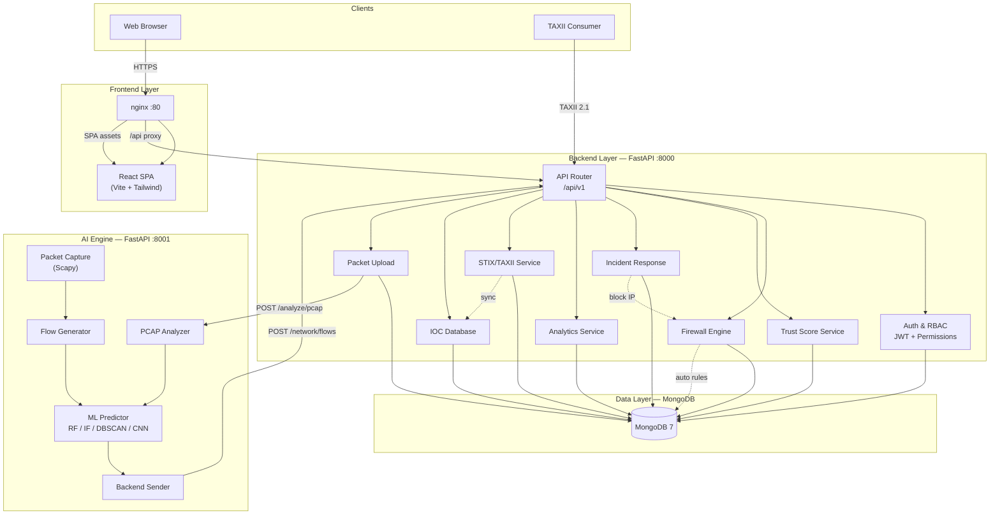
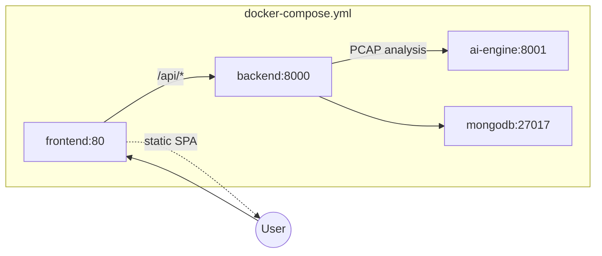
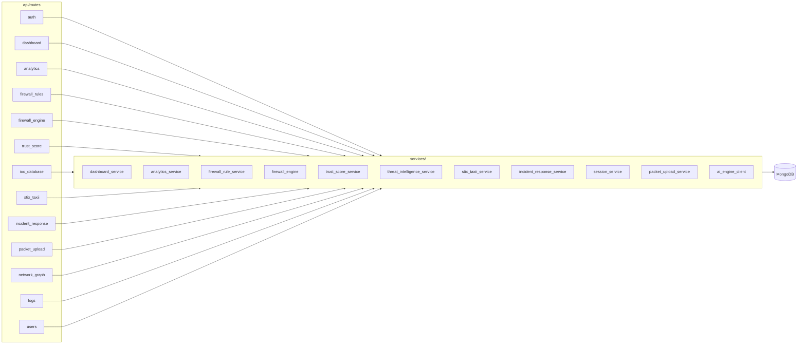
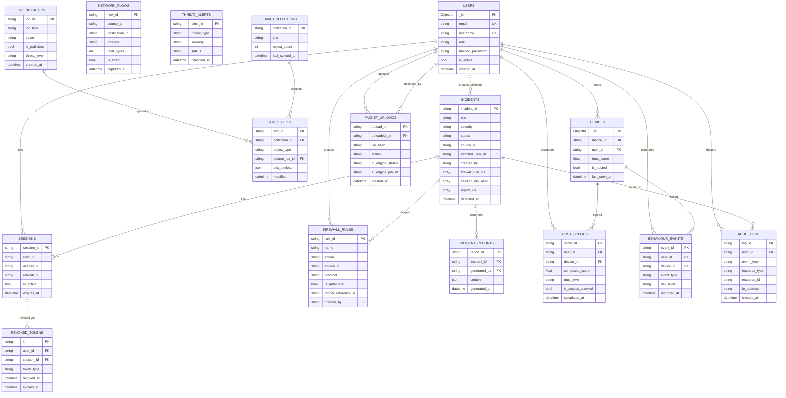
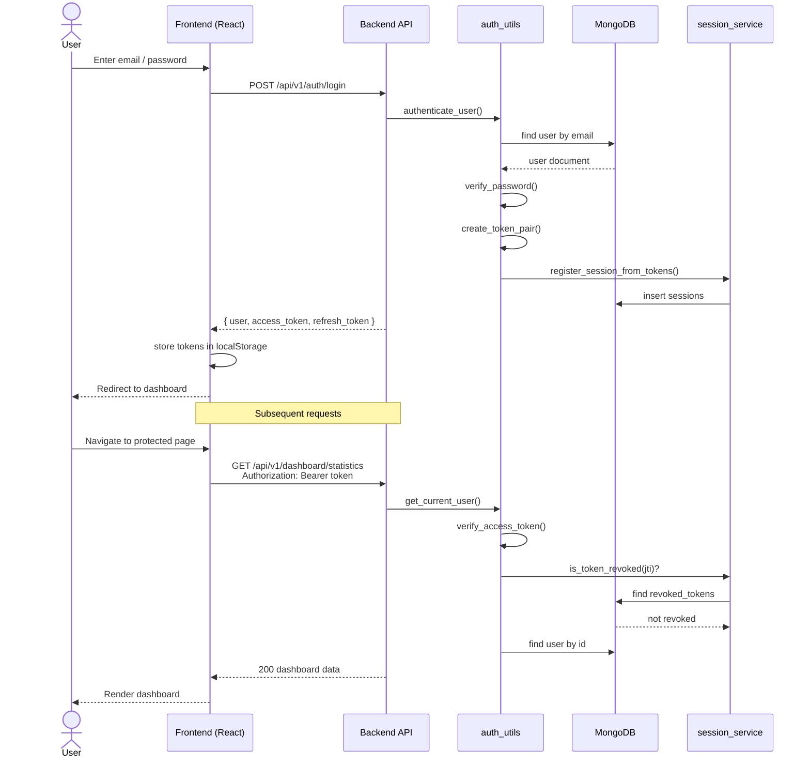
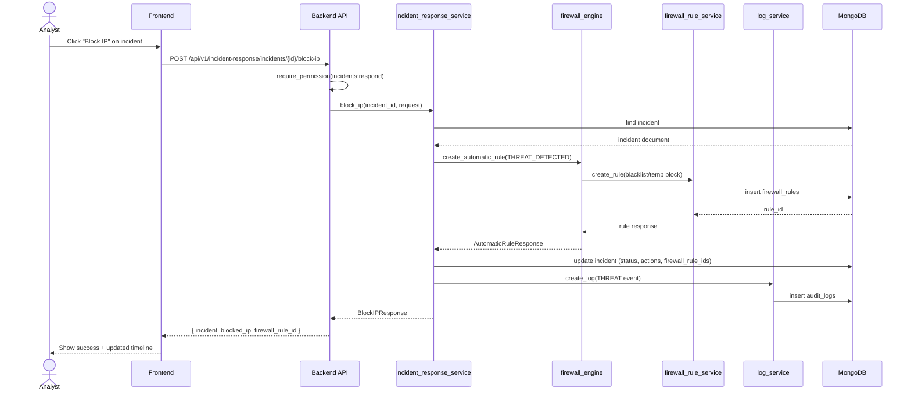
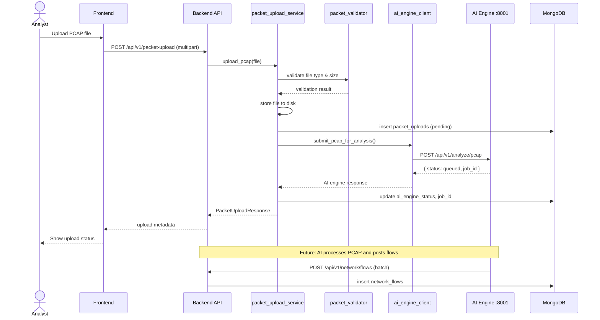
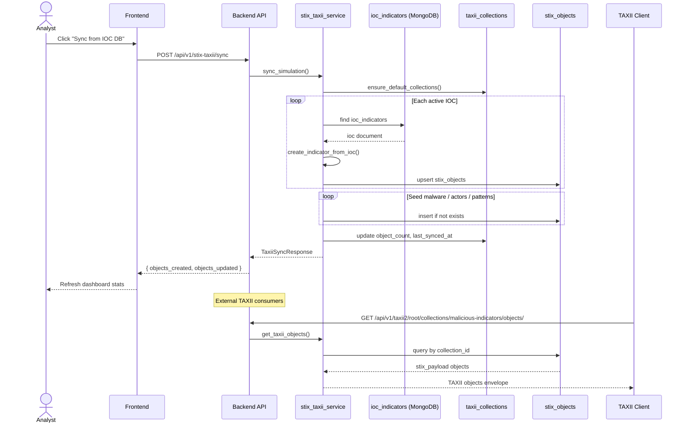
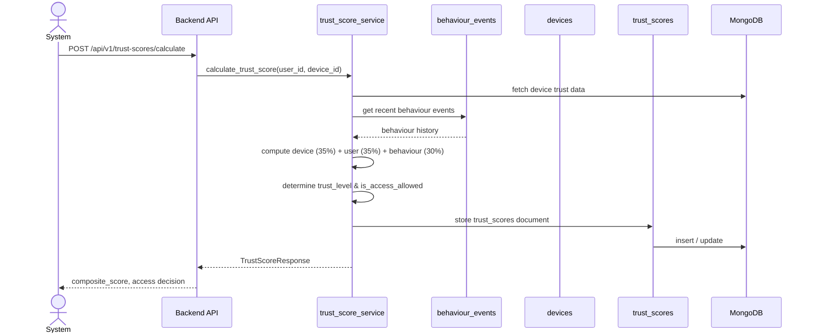
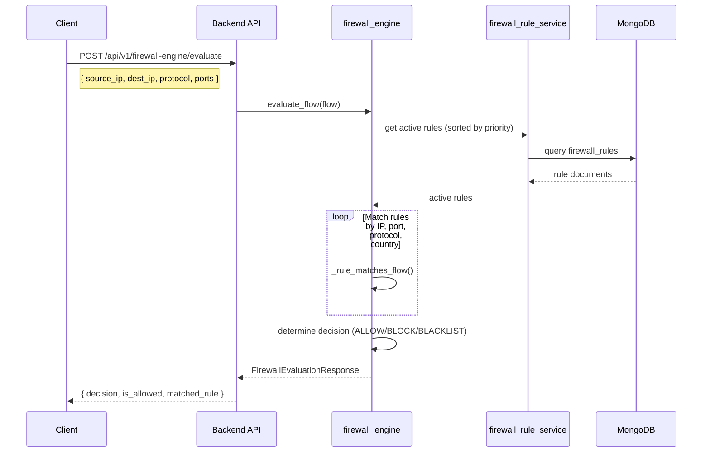

# AI-NGFW — System Diagrams

Mermaid diagrams for architecture, data model, and key runtime flows.

---

## 1. Architecture Diagram

High-level system architecture showing clients, services, and data stores.

### Docker deployment view

### Backend module map

---

## 2. ER Diagram

Entity-relationship model for MongoDB collections and logical references.

---

## 3. Sequence Diagrams

### 3.1 User authentication (login + JWT)

### 3.2 Incident response — Block IP

### 3.3 PCAP upload and AI analysis

### 3.4 STIX/TAXII IOC sync

### 3.5 Zero Trust trust score calculation

### 3.6 Firewall flow evaluation

---

## Diagram index

| Diagram | Type | Description |
|---------|------|-------------|
| Architecture (system) | Flowchart | End-to-end service topology |
| Architecture (Docker) | Flowchart | Container deployment |
| Architecture (modules) | Flowchart | Backend route → service map |
| ER Diagram | ER | MongoDB collections & relationships |
| Auth login | Sequence | JWT login and protected request |
| Incident block IP | Sequence | Containment action workflow |
| PCAP upload | Sequence | Packet upload → AI engine |
| STIX/TAXII sync | Sequence | IOC → STIX object sync |
| Trust score | Sequence | Zero Trust score calculation |
| Firewall evaluate | Sequence | Rule matching engine |
