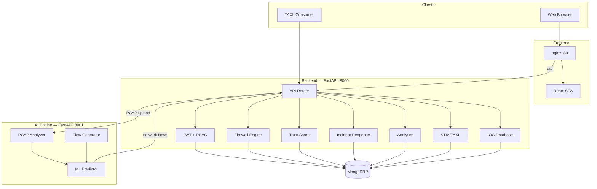

# Smart India Hackathon 2026 — Presentation

## AI-NGFW: AI-Powered Next Generation Firewall with Zero Trust Architecture

**Theme:** Cybersecurity & Digital Trust  
**Duration:** 8–10 minutes (demo + Q&A)  
**Team:** [Your Team Name] | [Institution] | [PS Number / Problem Statement ID]

---

## Slide 1 — Title

### AI-NGFW
**AI-Powered Next Generation Firewall with Zero Trust Architecture**

> *Detect. Decide. Defend — in real time.*

- Unified security console for enterprises, campuses, and critical infrastructure
- ML-driven threat detection + automated incident response
- Built for India's growing digital economy

---

## Slide 2 — Problem

### The Cybersecurity Gap in Modern Networks

| Challenge | Impact |
|-----------|--------|
| **Legacy firewalls** | Static rule-based filtering cannot adapt to evolving threats |
| **Reactive security** | Attacks are discovered after damage is done |
| **Siloed tools** | Firewall, SIEM, threat intel, and incident response live in separate systems |
| **Zero Trust gap** | "Trust but verify" fails — insider threats and lateral movement go undetected |
| **India's scale** | 750M+ internet users, rising ransomware, phishing, and APT campaigns |

### Real-World Pain Points

1. **SOC analysts** spend hours correlating logs across tools before acting
2. **Manual IP blocking** is slow — attackers pivot before rules are updated
3. **Threat intelligence** (STIX/TAXII) is rarely integrated into operational firewalls
4. **No continuous trust scoring** — users and devices are trusted once, forever
5. **PCAP analysis** requires specialized tools disconnected from the security dashboard

### Problem Statement (for judges)

> *How might we build an intelligent, unified firewall platform that proactively detects threats using AI, enforces Zero Trust access decisions, and automates incident response — reducing mean time to detect (MTTD) and mean time to respond (MTTR)?*

---

## Slide 3 — Solution

### AI-NGFW — One Platform, Full Security Lifecycle

```
┌─────────────┐    ┌──────────────┐    ┌─────────────┐    ┌──────────────────┐
│  Detect     │ →  │  Analyze     │ →  │  Decide     │ →  │  Respond         │
│  (AI/ML +   │    │  (Trust +    │    │  (Firewall + │    │  (Block IP,      │
│   PCAP)     │    │   Analytics) │    │   Zero Trust)│    │   Kill Session)  │
└─────────────┘    └──────────────┘    └─────────────┘    └──────────────────┘
```

### What We Built

| Module | Capability |
|--------|------------|
| **Zero Trust Dashboard** | Composite trust scores, risk gauges, allow/deny decisions |
| **AI Engine** | Ensemble ML (Random Forest, Isolation Forest, DBSCAN, CNN) on network flows |
| **Firewall Engine** | IP/CIDR, port, protocol, country rules + auto-generated blocks |
| **Threat Intelligence** | IOC database + STIX 2.1 / TAXII 2.1 threat sharing |
| **Incident Response** | Full lifecycle — investigate, contain (block IP), eradicate (kill session), report |
| **Analytics** | Daily/monthly traffic, protocol breakdown, geo distribution |
| **Security Console** | React dashboard with role-based access (Admin, Analyst, Viewer) |

### Key Value Proposition

- **Proactive** — ML detects anomalies before signature-based tools
- **Automated** — Incidents trigger firewall blocks and session revocation
- **Unified** — Single pane of glass for detection, intel, and response
- **Standards-compliant** — STIX/TAXII for interoperability with national CERT feeds

---

## Slide 4 — Architecture

### High-Level System Architecture



### Technology Stack

| Layer | Technology |
|-------|------------|
| Frontend | React 18, Vite, Tailwind CSS, Recharts |
| Backend | FastAPI, Pydantic v2, JWT, RBAC |
| AI/ML | Python, Scikit-learn, TensorFlow, Scapy |
| Database | MongoDB 7 |
| Deployment | Docker Compose (4 services) |
| APIs | 113 REST endpoints + TAXII 2.1 server |

### Docker Services

| Service | Port | Role |
|---------|------|------|
| `frontend` | 80 | SPA + nginx reverse proxy |
| `backend` | 8000 | REST API, business logic |
| `ai-engine` | 8001 | ML inference, PCAP analysis |
| `mongodb` | 27017 | Document store |

---

## Slide 5 — Innovation

### What Makes AI-NGFW Different

#### 1. AI + Zero Trust Fusion
- Traditional NGFWs filter packets; we **score trust continuously**
- Composite trust score combines device posture, behavior, and threat intel
- Access decisions are **dynamic**, not one-time login checks

#### 2. Ensemble ML Detection Pipeline
- **Random Forest** — supervised classification of known attack patterns
- **Isolation Forest** — unsupervised anomaly detection
- **DBSCAN** — clustering of suspicious flow groups
- **CNN (TensorFlow)** — deep learning on packet/feature sequences

#### 3. Closed-Loop Incident Response
```
Alert → Incident Created → Analyst Reviews → Block IP (auto firewall rule)
                                            → Kill Session (JWT revocation)
                                            → Generate Report (audit trail)
```

#### 4. STIX/TAXII Threat Sharing
- Built-in TAXII 2.1 server — share and consume IOCs
- Auto-sync from internal IOC database to STIX bundles
- Enables integration with **CERT-In** and sectoral ISACs

#### 5. Real-Time Analytics at Scale
- Protocol, country, and time-series traffic analytics
- Network graph visualization of flow topology
- Geo-distributed attack pattern identification

### Innovation Summary (for judges)

| Innovation | Traditional Approach | Our Approach |
|------------|---------------------|--------------|
| Threat detection | Signature-based | ML ensemble + anomaly detection |
| Access control | Perimeter trust | Continuous Zero Trust scoring |
| Response | Manual ticketing | Automated block + session kill |
| Intel sharing | Proprietary feeds | Open STIX/TAXII standard |
| Deployment | Hardware appliance | Containerized, cloud-ready |

---

## Slide 6 — Future Scope

### Roadmap

#### Phase 1 — Near Term (3–6 months)
- [ ] **WebSocket real-time alerts** — push threat notifications to dashboard
- [ ] **Full AI pipeline integration** — live packet capture → ML → auto-block
- [ ] **SIEM integration** — export to Elastic, Splunk, Wazuh
- [ ] **Mobile SOC app** — incident triage on the go

#### Phase 2 — Medium Term (6–12 months)
- [ ] **CERT-In / NCIIPC integration** — ingest national threat feeds via TAXII
- [ ] **Multi-tenant SaaS** — serve MSMEs and educational institutions
- [ ] **Behavioral biometrics** — user entity behavior analytics (UEBA)
- [ ] **Kubernetes deployment** — Helm charts for cloud-native scale

#### Phase 3 — Long Term (12–24 months)
- [ ] **Hardware appliance** — edge NGFW for smart cities and IoT gateways
- [ ] **Federated learning** — train ML models across orgs without sharing raw data
- [ ] **Quantum-safe cryptography** — post-quantum TLS inspection readiness
- [ ] **AI explainability** — SHAP/LIME for regulatory compliance (DPDP Act)

### Alignment with National Initiatives

| Initiative | How AI-NGFW Contributes |
|------------|------------------------|
| **Digital India** | Secure digital infrastructure for citizens and businesses |
| **National Cyber Security Strategy** | Proactive defense, threat intel sharing |
| **Smart Cities Mission** | Edge security for IoT and municipal networks |
| **DPDP Act 2023** | Audit logs, session control, incident reporting |
| **Make in India** | Indigenous, deployable security platform |

---

## Slide 7 — Demo Flow

### Live Demo Script (8 minutes)

#### Pre-Demo Setup
```bash
docker compose up --build -d
# Open http://localhost
# Login: admin credentials (seeded)
```

---

#### Step 1 — Login & Dashboard (30 sec)
1. Open the security console at `http://localhost`
2. Login as **Admin** — show JWT auth and role-based sidebar
3. Highlight the main dashboard overview

**Talking point:** *"Role-based access ensures analysts see incidents, viewers see read-only analytics."*

---

#### Step 2 — Zero Trust Dashboard (1 min)
1. Navigate to **Zero Trust**
2. Show composite **trust score** and risk gauge
3. Demonstrate an **allow/deny** access decision based on trust level

**Talking point:** *"We never trust by default — every session is continuously scored."*

---

#### Step 3 — Threat Detection & Analytics (1.5 min)
1. Open **Threat Analytics** — attack trends, severity distribution
2. Open **Analytics** — daily traffic chart, protocol breakdown, country map
3. Show **Network Graph** — visual flow topology

**Talking point:** *"SOC teams get instant visibility into what's hitting the network and from where."*

---

#### Step 4 — IOC & STIX/TAXII (1.5 min)
1. Open **IOC Database** — browse IP/domain/hash indicators
2. Open **STIX/TAXII** — show TAXII collections and STIX bundles
3. Demonstrate sync from IOC → STIX objects

**Talking point:** *"We speak the industry standard — any TAXII consumer can subscribe to our threat feeds."*

---

#### Step 5 — Incident Response (2 min)
1. Open **Incidents** — show incident list with severity badges
2. Select an incident → view timeline and details
3. Execute **Block IP** — show auto-generated firewall rule
4. Execute **Kill Session** — demonstrate JWT revocation
5. **Generate Report** — download JSON incident report

**Talking point:** *"From alert to containment in seconds — not hours."*

---

#### Step 6 — Firewall & PCAP (1 min)
1. Open **Firewall** — show rules (IP, port, protocol, country)
2. Upload a **PCAP file** — trigger AI engine analysis
3. Show analysis results flowing back to the dashboard

**Talking point:** *"Analysts can upload captures and get ML-powered threat classification instantly."*

---

#### Step 7 — Closing (30 sec)
1. Show **API Docs** at `http://localhost:8000/docs` — 113 endpoints
2. Mention Docker one-command deployment
3. Recap: Detect → Decide → Defend

---

### Demo Fallback (if live demo fails)
- Use screenshots from each dashboard tab
- Show `docs/DIAGRAMS.md` architecture diagrams
- Walk through `docs/API.md` endpoint list

---

## Slide 8 — Impact & Metrics

### Expected Impact

| Metric | Before | With AI-NGFW |
|--------|--------|--------------|
| Mean Time to Detect (MTTD) | Hours | Minutes (ML real-time) |
| Mean Time to Respond (MTTR) | Hours (manual) | Seconds (auto block/kill) |
| Tools required | 4–6 separate | 1 unified platform |
| Threat intel integration | Manual CSV import | STIX/TAXII auto-sync |
| Deployment time | Weeks (hardware) | Minutes (Docker) |

### Target Users
- **Educational institutions** — campus network security
- **MSMEs** — affordable, software-based NGFW
- **Government departments** — compliance-ready audit and incident reporting
- **SOC teams** — unified analyst workstation

---

## Slide 9 — Team & Q&A

### Team

| Name | Role | Contribution |
|------|------|--------------|
| [Member 1] | Team Lead / Backend | FastAPI, incident response, STIX/TAXII |
| [Member 2] | Frontend | React dashboard, analytics UI |
| [Member 3] | AI/ML | ML models, PCAP pipeline |
| [Member 4] | DevOps / Security | Docker, firewall engine, testing |
| [Member 5] | Documentation / Demo | API docs, presentation, demo script |
| [Member 6] | Research / Innovation | Zero Trust, threat intel research |

### Repository & Documentation
- **README** — installation, features, usage
- **docs/DIAGRAMS.md** — architecture, ER, sequence diagrams
- **docs/API.md** — 113 endpoints with curl examples
- **docker-compose.yml** — one-command full-stack deployment

### Thank You

**AI-NGFW** — Detect. Decide. Defend.

*Questions?*

---

## Appendix — Judge Q&A Prep

### Likely Questions & Answers

**Q: How is this different from commercial firewalls (Palo Alto, Fortinet)?**  
A: We combine NGFW, Zero Trust, ML detection, and STIX/TAXII in one open, containerized platform — no hardware lock-in, fully customizable, and deployable on-premises or cloud.

**Q: What ML models do you use and how accurate are they?**  
A: Ensemble of Random Forest (supervised), Isolation Forest (anomaly), DBSCAN (clustering), and CNN (deep learning). Accuracy depends on training data; we support retraining on organizational traffic baselines.

**Q: How do you handle false positives?**  
A: Analysts review incidents before auto-block; severity scoring and trust scores reduce noise; firewall rules can be temporary with expiry.

**Q: Is it production-ready?**  
A: Core platform is functional with 113 API endpoints, Docker deployment, RBAC, and audit logging. Production hardening (HTTPS, secrets management, HA) is on the roadmap.

**Q: How does Zero Trust work in your system?**  
A: Composite trust score from device posture, behavioral signals, and threat intel. Below-threshold scores trigger deny decisions and elevated monitoring.

**Q: STIX/TAXII — who consumes your feeds?**  
A: Any TAXII 2.1 client — sectoral ISACs, internal SOCs, or national CERT platforms. We also ingest external feeds into our IOC database.

**Q: Scalability?**  
A: Microservices architecture (frontend, backend, AI engine, MongoDB) scales horizontally. AI engine can be replicated for high-throughput PCAP analysis.

**Q: Compliance with Indian regulations?**  
A: Audit logs, incident reports, session management, and data localization (self-hosted MongoDB) align with DPDP Act and CERT-In guidelines.

---

## Appendix — One-Liner Pitches

**30 seconds:**  
*"AI-NGFW is an AI-powered next-generation firewall with Zero Trust architecture. It uses machine learning to detect threats in real time, scores trust continuously, automates incident response with IP blocking and session revocation, and shares threat intelligence via STIX/TAXII — all in one Docker-deployable platform."*

**60 seconds:**  
*"India's digital growth demands smarter cybersecurity. Legacy firewalls can't keep up. AI-NGFW combines an ensemble of ML models for proactive threat detection, a Zero Trust engine for continuous access decisions, automated incident response, and standards-based threat sharing — packaged in a modern React security console with 113 API endpoints. Deploy with one Docker command. Detect, decide, defend."*
